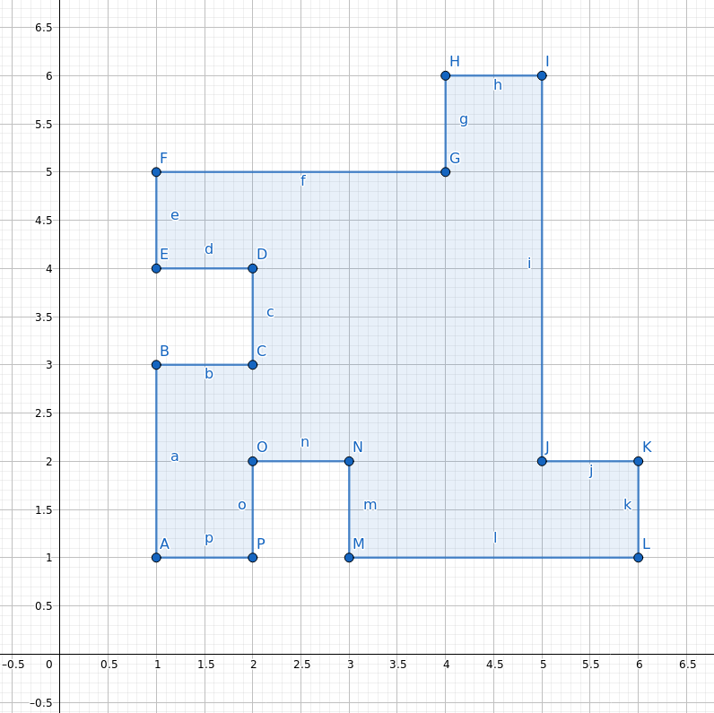

# Creeper, Aww Man

So you were back in the mine, and you had your pickaxe swinging from side to side. There you were, minding your own business, and the next thing you know, you have been flung 100 metres away and there is a massive crater where you were standing just a second ago. Staring down at the crater, you wonder just how much area was excavated by the mysterious explosion.

The crater can be modelled as a giant polygon, with the corners of the polygon at integer coordinates. Strangely, the sides of the polygon are either perfectly vertical or perfectly horizontal. There are also no holes inside the polygon (apart from the hole itself, of course).

You quickly take measurements of the crater, and get out your trusty redstone laptop to work out the area of the crater.

## Input

The first line of input contains the integer N, the number of corners in your polygon.

The next N lines contain two integers each. The $i$-th of these lines contains the integers $x_i$ and $y_i$, giving the x and y positions of the i-th point of your polygon. Points will be given in order (clockwise or counterclockwise) around the edge of the polygon.

## Output

Output a single integer: the area of the polygon you are measuring. Note that this area may exceed $2^{31}-1$.

### Sample Input 1

```
16
1 1
1 3
2 3
2 4
1 4
1 5
4 5
4 6
5 6
5 2
6 2
6 1
3 1
3 2
2 2
2 1
```

### Sample Output 1

```
16
```
### Explanation

The above input corresponds to the below diagram.




## Subtasks and Constraints

For all subtasks, $N \le 100000​$ and $1 \le x_i, y_i \le 1000000000​$.

For subtask 1 (20 pts): $N \le 10$ and $1 \le x_i, y_i \le 10$.

For subtask 2 (40 pts): $y_1$ = 1, $y_N = 1$, and $x_{i+1} \ge x_i$ for all $i$ from $1$ to ​$N-1​$. In other words, the polygon forms a "city skyline".

For subtask 3 (40 pts): No further constraints.

